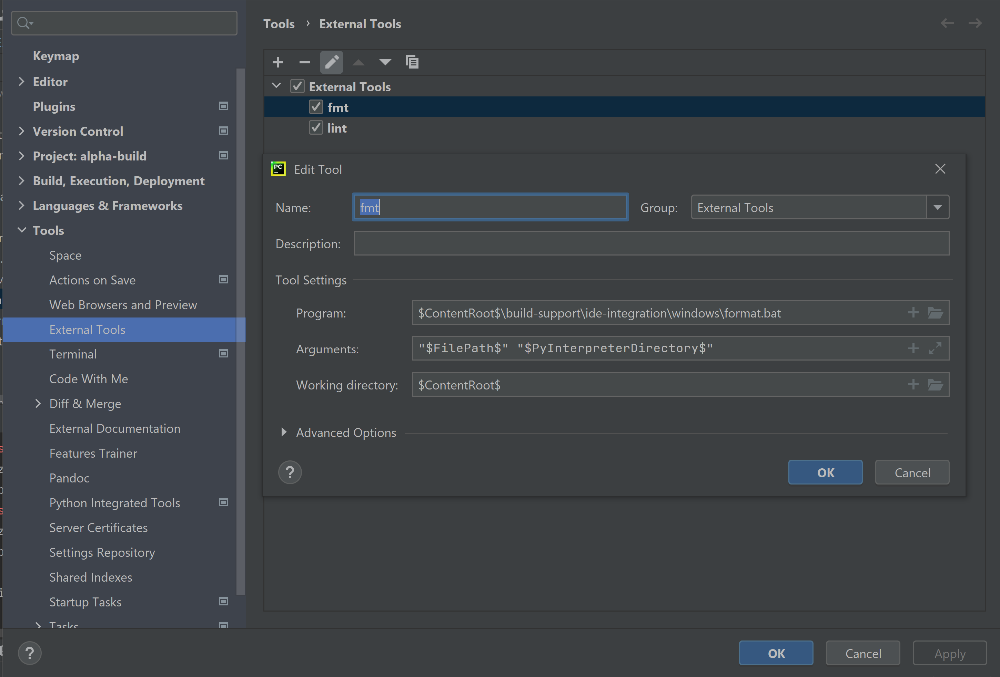
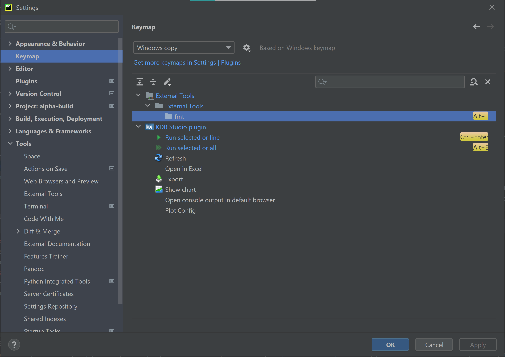

# AlphaBuild

[
](https://www.gnu.org/software/make/manual/make.html)
[
](https://www.gnu.org/software/bash/)
[
](https://www.python.org/)
[
](https://jupyter.org/)
[
](https://www.gnu.org/software/bash/)
[
](https://www.markdownguide.org/)
[
](https://www.haskell.org/)
[
](https://www.linux.org/)
[
](https://www.microsoft.com/en-us/windows)
[
](https://www.apple.com/macos/)
[
](https://www.jetbrains.com/pycharm/)
[
](https://azure.microsoft.com/en-us/services/devops/)
[
](https://github.com/features/actions)
[
](https://www.jenkins.io/)
[
](https://www.jenkins.io/)

AlphaBuild is a simple monorepo build tool based on Make with out-of-the-box support for numerous tools in the
Python, Bash, Jupyter Notebooks, Markdown, YAML ecosystems and with a strong focus on extensibility.

The way AlphaBuild works draws inspiration heavily from monorepo build tools such as Pants, Bazel, Buck.
It can run at once multiple linters, formatters, type checkers, hermetic packers, testing frameworks, virtual
environment managers etc.

1. [Platforms](#Platforms)
2. [Usage](#Usage)
   1. [Goals - what tools we run](#goals---what-tools-we-run)
   2. [Targets - what files we run the tools on](#targets---what-files-we-run-the-tools-on)
3. [AlphaBuild structure](#alphabuild-structure)
4. [IDE Integration](#ide-integration)
5. [Example monorepo running AlphaBuild](#example-monorepo-running-alphabuild)
6. [Common admin actions](#common-admin-actions)
   1. [Installation](#installation)
   2. [CI/CD Setup](#cicd-setup)
   3. [Upgrade](#upgrade)
   4. [Change goal definitions](#change-goal-definitions)
   5. [Add goals](#add-goals)
   6. [Update PYTHONPATH](#update-pythonpath)
   7. [See/Change tools config](#seechange-tools-config)
   8. [Third party environments](#third-party-environments)
   9. [Nested Makefiles](#nested-makefiles)
   10. [Generate requirements.txt for each sub-project](#generate-requirementstxt-for-each-sub-project)
   11. [Generate setup.py for each sub-project](#generate-setuppy-for-each-sub-project)
   12. [Markdown badge](#markdown-badge)
7. [Out-of-the-box tools by language](#out-of-the-box-tools-by-language)
8. [Comparison with Pants, Bazel, Pre-commit,
Makefiles](#comparison-with-pants-bazel-pre-commit-and-traditional-makefiles)
9. [Limitations](#limitations)

## Platforms

AlphaBuild works on Linux distributions, MacOS, WSL and Windows with Git Bash.
`Make` and `Bash` are AlphaBuild's only pre-requisites (Note: Bash with GNU utilities, not BSD utilities).

### Linux, WSL

Since Linux is awesome and WSL follows its footsteps, AlphaBuild should just work there.

### MacOS

AlphaBuild relies heavily on the GNU version of `find` and `egrep`, so, if you are running an OS which,
by default, uses BSD rather than GNU (pointing fingers to MacOS here, you may need to
`brew install` `findutils` and `grep`, see: <https://xenodium.com/gnu-find-on-macos/>)

Also, AlphaBuild may not work if you have ancient versions of `Make` / `Bash`, so try upgrading them if some commands
don't seem to work. Macs typically come equipped with ancient versions of `Bash`.

### Windows

On Windows, `Make` and `Bash` are not supported out-of-the-box, so it is recommended to use AlphaBuild on Windows within
Git Bash. Note that Git Bash does not come with Make pre-installed. Once you downloaded and installed Git Bash
run `build-support/git-bash-integration/install_make.sh` running Git Bash as administrator. Alternatively, you may get
`Make` from `conda`.

## Usage

Usually to format, lint, type-check, test, package, ... the code, one needs to run a bunch of commands in the terminal,
setting the right flags and the right parameters. This Make-based build system helps with running these commands with
a very simple interface:

`make <goal> <optional-targets>`

where

- **goal = what tools we run**
- **targets = over which files we run these tools**.

### Goals - what tools we run

Goals mean what command line tools to run. This build system can run one more tools at once as follows:

- Single **individual** tool
  - e.g. `make mypy`, `make flake8`, `make isort`
- Multiple tools for a **specific language**
  - e.g. `make fmt-py` runs all Python formatters e.g. `isort`, `black`, `docformatter`, `flynt`, `autoflake`
  - e.g. `make fmt-sh` runs `shfmt`
  - e.g. `make lint-py` runs Python all linters and all formatters in "verification" mode, that is `flake8` + `pylint` +
  check whether the code is already formatted with `isort`, `black`, `docformatter`, `flynt`, `autoflake`
  - `make fmt-md`, `make lint-yml`, `test-sh`, `test-py` ... work similarly
- Multiple tools for **multiple languages**
  - e.g. `make fmt` runs all formatters for all supported languages (Python, Bash, Markdown, YAML, ...)
  - e.g. `make lint` runs all linters for all supported languages
  - e.g. `make test` runs all test suites for all supported languages

It is possible to run multiple goals at once like `make lint test`. In addition, it is very easy to change the meaning
of goals that run more than one command since they are very simply defined in Make based on other goals. For example,
one can remove the `shfmt` from bash linting simply by doing the below:  

```makefile
# Before
lint-sh: shellcheck shfmt-check  # where shellcheck and shfmt-check run the respective commands
# After
lint-sh: shellcheck
```

Per-tool config files (e.g. `mypy.ini`, `pyproject.toml`) are found in `build-support/<language>/tools-config/`.

### Targets - what files we run the tools on

We have seen that Make gives us the power to run multiple terminal commands effortlessly. Using a Makefile like
described above is standard practice in many projects, typically running the different tools over all their files.
However, as projects grow, the need to run these tools at different granularities (e.g. in a specific directory,
over a given file, on the diff between two branches, since we last committed etc). This is where targets come into play.

#### With default targets

The default targets per-language are defined at the top of the `Makefile` in language specific variables
e.g. `ONPY=py-project1/ py-project2/ script.py` and `ONSH=scripts/`.

- `make lint` runs:
  - all Python linters on all directories (in the `$ONPY`) that contain Python/stub files.
  - all notebook linters on all directories (in `$ONNB`) that contain `.ipynb` files.
  - all Bash linters (shellcheck) on all directories (in `$ONSH`) that contain Bash files.
  - a Haskell linter (hlint) on all directories (in `$ONHS`) that contain Haskell files.
  - a YAML linter (yamllint) on all directories (in `$ONYML`) that contain YAML files.
- `make lint`, `make fmt -j1`, `make type-check` work similarly
- remember that the `$(ONPY)`, `$(ONSH)`, ... variables are defined at the top of the Makefile and represent the
default locations where AlphaBuild searches for files certain languages.

#### With specific targets

To specify manually the files/directories you want to run your tools on, AlphaBuild leverages the "on" syntax:

- **file:** `make lint on=app_iqor/server.py` runs all Python linters on the file, same
    as `make lint-py on=app_iqor/server.py`
- **directory:** `make lint on=lib_py_utils` runs a bunch of linters on the directory, in this case, same
    as `make lint-py on=lib_py_utils/`.
- **files/directories:** `make lint on="lib_py_utils app_iqor/server.py"` runs a bunch of linters on both targets.
- **globs:** `make lint on=lib_*`
- **aliases:** `make fmt on=iqor` where at the top of the Makefile `iqor=app_iqor/iqor app_iqor/test_iqor`, this is the
same as `make fmt on=app_iqor/iqor app_iqor/test_iqor` because `iqor` is an alias for
`app_iqor/iqor app_iqor/test_iqor`. Even though this example is simplistic, it is useful to alias combinations of
multiple files/directories. It is recommended to set aliases as constants in the Makefile even though environment
variables would also work.
- same for `make fmt`, `make test`, `make type-check`.

#### With git revision targets

- `make fmt -j1 since=master` runs all formatters on the diff between the current branch and master.
- `make fmt -j1 since=HEAD~1` runs all formatters on all files that changed since "2 commits ago".
- `make lint since=--cached` runs all linters on all files that are "git added".
- all goals that support the "on" syntax also support the "since" syntax

#### Mixed "on" and "since"

One can use the "on" and "since" syntaxes at the same time. For example:

- `make lint on=my_dir/ since=HEAD~2` will run all linters on all files in `my_dir/` that changed since "3 commits ago".

#### Constraints

Different languages may have different goals, for example Python can be packaged hermetically with Shiv, while Bash
obviously can't.

The following goals must support the "on" and "since" syntax and ensure that they are only run if there are any targets
for the language they target:

- format
- lint
- type-check
- test

If you want to learn more about the API of a specific goal, check the source code.

## AlphaBuild structure

- **Makefile:** AlphaBuild's entry point, this is where all components come together.
- **3rdparty/:** Files required to build environments of 3rd party dependencies (e.g. requirements.txt files,
package.json or lock files)
- **build-support/:** Makefile library inspired by Pants/Bazel to run linters, formatters, test frameworks, type
  checkers, packers etc. on a variety of languages (Python, Jupyter Notebooks, Bash, Haskell, YAML, Markdown)
  - The flags used per-tool (e.g. setting the paths to config files) can be found in
  `build-support/make/config/<lang>.mk`
  - The core part of AlphaBuild lives in `build-support/make/core/`, this comprises the build-system backbone
  `resolver.mk` and recipes to run lots of readily-available tools. This should be the same for all monorepos that
  use AlphaBuild.
  - By convention, repo-specific custom goals go in `build-support/make/extensions/` following the examples in `core`.
  - `build-support/<other-programming-lang-than-make>/` contain things like config files for each tool and other files
  required for your custom AlphaBuild goals.

## IDE Integration

- **PyCharm / IntelliJ**
  - Windows: On Windows, it is advised to set Git Bash as the default "Terminal". In "settings" search for "terminal",
  go to "Tools → Terminal" and set "Shell Path" to something like `C:\Program Files\Git\bin\bash.exe`.
  - PYTHONPATH: If you are writing Python, please mark the directories for each project as "Sources Roots", such that
  PyCharm discovers your imports.
  - AlphaBuild hotkeys: It is easy to use AlphaBuild with hotkeys. For example, mapping `Alt+F` to
  `make fmt -j1 on=<current-file>` and `Alt+L` to `make lint on=<current-file>`. To set this up, follow the example in
  `build-support/ide-integration/windows/` to set up an external tool. Unix systems would be similar. Next, just map the
  new external tools to your hotkeys.
  
  

## Example monorepo running AlphaBuild

To see AlphaBuild at work in a real-world example check <https://github.com/cristianmatache/workspace> out.
Workspace extends AlphaBuild with support for Prometheus, Alertmanager and Grafana.

## Common admin actions

### Installation

To add this build system to an existing repo, one needs to simply copy over `build-support/`, `3rdparty/`, `Makefile`.

Create a conda environment, activate it and `make env-default-replicate`, as a one-off, to set up the python, markdown
and bash environments (mostly pip/npm install-s).

#### CI/CD setup

Since all CI/CD pipelines essentially rely on running some scripts in a certain order, AlphaBuild can be called
directly from any CI/CD pipeline regardless of CI/CD technology provider. AlphaBuild helps with ensuring that both the
CI pipelines and developers run the exact same commands. Since, one can easily select targets within the repo, setting
pipelines on a per sub-project basis, is effortless with AlphaBuild.

#### Upgrade

To upgrade an existing installation if new tools are added or changes are made to the target resolution infrastructure,
one would simply need to copy over `lib-support/make/core`.

#### Change goal definitions

Let's say, for example, you don't want to run `pylint` as part of your python linting. You would simply go to the
`Makefile` and change the definition of the `lint-py` goal to not include `pylint`.

#### Add goals

The goals that are available out of the box are found in `build-support/make/core/<language>/`.
You can extend/replace the core goals for new languages and/or tools by writing `.mk` code in
`build-support/make/extensions/<language>/` following the examples in `build-support/make/core/`.
For example, <https://github.com/cristianmatache/workspace> extends AlphaBuild with Prometheus and Alertmanager goals.

#### Update PYTHONPATH

The PYTHONPATH is set at the top of the `Makefile`. For example, to add new directories to
the PYTHONPATH (i.e. to mark them as sources roots) set `PY_SOURCES_ROOTS` at the top of the Makefile.

#### See/Change tools config

Let's say you want to change the way `mypy` is configured to exclude some directory from checking. Then head to
`build-support/make/config/python.mk` check what is the path to the `mypy` config file, go there and update it.
All other tools work similarly.

#### Third party environments

- **Exact reproduction of the default environment:** The recipes to fully replicate the default environment
(mostly using `pip`, `conda` and `npm`) are found in `build-support/make/core/<langugage>/setup.mk`, where they use
dependency files and lock files that can be found in `3rdparty/`. In practice, run `make env-default-replicate` inside
a conda environment. Also make sure you also have `npm` installed because `markdownlint` and `bats` bash testing
framework come from `npm` (if you don't need them no need to worry about `npm` just exclude the `markdown`
environment rule from the pre-requisites of `env-default-replicate`)
- **Create/Upgrade/Edit default environment:** If you want to edit the default environment, for example to add,
remove, constrain packages edit the `requirements.txt` not the `constraints.txt` file (in `3rdparty/`).
The `constraints.txt` is only used for reproducibility. If you just want to upgrade your third party dependencies
there is no need to temper with the `requirements.txt` files. Then run `make env-default-upgrade` and check the lock
files back into git.
- **Add a new environment:** To add a new environment, first add the dependency files (e.g. `requirements.txt`) in
`3rdparty/<new-env-name>`, add a new goal in `build-support/make/extensions`. For environment management over time, we
strongly encourage maintaining the approach split between creation/upgrade/edit and exact reproduction of
environments.

#### Nested Makefiles

Supposing you want to have another `Makefile` for a specific project in the monorepo, just
import everything that you need from `build-support/make/core/` and/or `build-support/make/extensions/`. To change the
Now let's say you want to use a different config file for `mypy`. You would have 2 options, either change the path
globally `build-support/make/config/python.mk` or, if you just want different settings for your little project use
your inner `Makefile` to overwrite the value of the corresponding variable (that points to the config file) with the
different path.

#### Generate requirements.txt for each sub-project

Run `make reqs-py`.

#### Generate setup.py for each sub-project

Run `build-support/python/packaging/generate_pip_install_files.py`

#### Markdown badge

If you like AlphaBuild, wear the Markdown badge on your repo:
[
](https://github.com/cristianmatache/alpha-build)

```markdown
[
](https://github.com/cristianmatache/alpha-build)
```

## Out-of-the-box tools by language

AlphaBuild has recipes to run the following tools. However, if you don't use some of them you don't need to have them
installed in your enviornments. For example, let's say you don't use `bandit` then you don't need to have `bandit`
installed in your environment provided that you are not using the `bandit` goal per-se or as part of a composite goal
like `lint-py` or `lint`.

- Python:
  - Setup: `pip` / `conda`
  - Type-check: `mypy`
  - Test: `pytest`
  - Format + Lint: `black`, `docformatter`, `isort`, `autoflake`, `flynt`, `pre-commit`
  - Lint only: `flake8`, `pylint`, `bandit`
  - Package: `pipreqs`, `shiv`
- Jupyter:
  - Setup: `pip`
  - Format + Lint: `jupyterblack`, `nbstripout`
  - Lint only: `flake8-nb`
- Bash:
  - Setup: `npm` and `conda`
  - Test: `bats` (bash testing: `bats-core`, `bats-assert`, `bats-support`)
  - Format + Lint: `shfmt`
  - Lint only: `shellcheck`
- Haskell:
  - Lint: `hlint`
- YAML:
  - Setup: `pip`
  - Lint: `yamllint`
- Prometheus and Alertmanager YAML:
  - Lint: `promtool check`, `amtool check-config`
- Markdown:
  - Setup: `npm`
  - Format + Lint: `markdownlint`

It is very easy to extend this list with another tool, just following the existing examples.

## Comparison with Pants, Bazel, Pre-commit and traditional Makefiles

Modern build tools like Pants or Bazel work similarly to AlphaBuild in terms of goals and targets, but they also add
a caching layer on previous results of running the goals. While they come equipped with heavy machinery to support
enormous scale projects, they also come with some restrictions and specialized maintenance and contribution requirements.

For example, Pants which, in my opinion, is the most suitable modern build tool for Python doesn't allow building
environments with arbitrary package managers (e.g. conda, mamba), does not work on Windows, prohibits inconsistent
environments (which is good but sometimes simply impossible in practice), does not yet support multiple environments.
Bazel, requires maintaining the dependencies between Python files twice, once as "imports" in the Python files
(the normal thing to do) and twice in some specific `BUILD` files that must be placed in each directory (by contrast
Pants features autodiscovery). Maintaining the same dependencies in two places is quite draining. Of course, these tools
come with benefits like (remote) caching, incrementality and out-of-the-box support for hermetic packaging (e.g. PEXes),
remote execution etc. Moreover, playing with some new command line tools, or new programming languages / types of files
(e.g. Jupyter Notebooks, Markdown, YAML) may be challenging with these frameworks. The Pants community is very welcoming
and supportive towards incorporating new tools, so it would be good to give Pants a try first. However, if any of the
mentioned shortcomings is a hard requirement, Make seems like a good and robust alternative in the meanwhile which
withstood the test of time in so many settings. AlphaBuild's strengths are its flexibility, simplicity, transparency and
tooling richness. One can quickly hack/add a new tool, see the commands that run under the hood and does not need to
worry about BUILD files or the config language.

Since AlphaBuild is essentially a script manager (Python, Bash, Perl, anything) enhanced with advanced
target/file/directory selection, AlphaBuild would allow an incremental adoption of large-scale build tools like Pants.
For example, in the main Makefile, one could do:

```make
# Makefile

lint-with-pants:
   $(eval on := ::)  # Default value if the user does not specify "on" in the terminal command like: make goal on=.
   ./pants lint $(on)

lint: lint-md lint-nb lint-yml lint-with-pants
```

such that running a command like the below would delegate most of the work to Pants while using AlphaBuild's core or
custom capabilities not yet available in Pants (e.g. linting notebooks, markdown or YAML files).

```bash
make lint on=my-dir/
```

Pre-commit and typical usages of Make work exceptionally well on small projects but they don't really scale well to
multi-projects monorepos. The build system proposed here, already incorporates `pre-commit` and is obviously compatible
with any existing Makefiles. This approach simply takes the idea of advanced target selection and ports it over to
classical techniques like pre-commit and Make.

## Limitations

Since AlphaBuild is essentially a small-repo tool (Python Makefile) adapted to work on larger codebases (through target
selection), there is a point from where it will no longer be able to scale up. Fortunately, that point is quite far away
from medium-sized repos/teams.

In addition, AlphaBuild requires that the commands it builds are shorter than `getconf ARG_MAX` characters.
